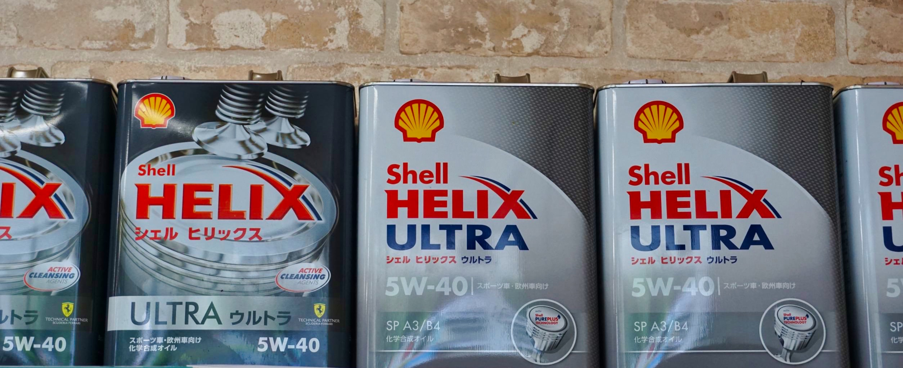

### エンジンオイル

<!-- OW-16
OW-20
5W-30
5W-50
10W-30   -->

エンジンオイルの定期的な交換は、エンジンを保護するとともに車の安全走行に欠かすことのできない重要なメンテナンスです。

お車に合わないオイルを入れてしまうと、`燃費の悪化やエンジンが故障`してしまう原因となります。作業は１０分から１５分で完了します

  

### オイルエレメント交換

エンジンオイルをろ過する働きのあるエレメントも定期的な交換が必要です

### エンジンオイルボトルキープ

20㍑のまとめ買いで通常販売価格よりもお得にオイル交換することができます。（交換工賃無料）

## ご予約・お問い合わせはこちら
<a href="tel:0260272235">☎ 0260-27-2235</a>

####  営業時間：月-土, 7:00-20:00（祝日は休業日）
####  長野県下伊那郡下條村睦沢９２９７−４