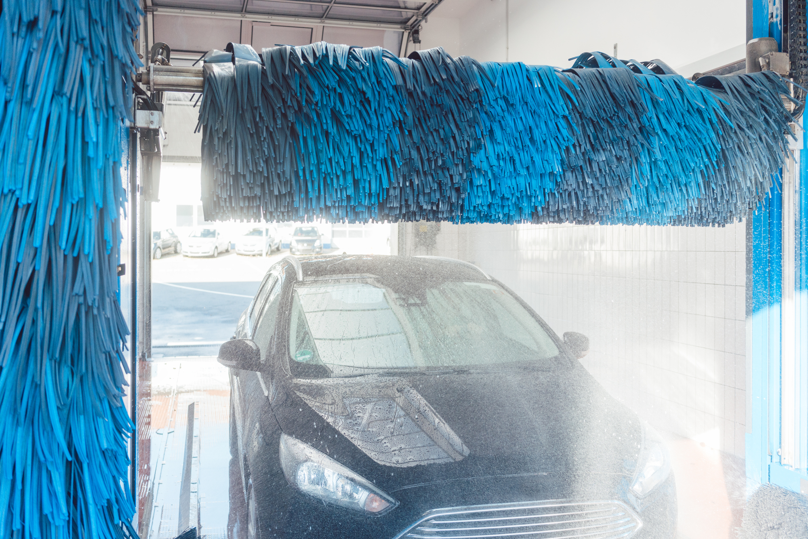
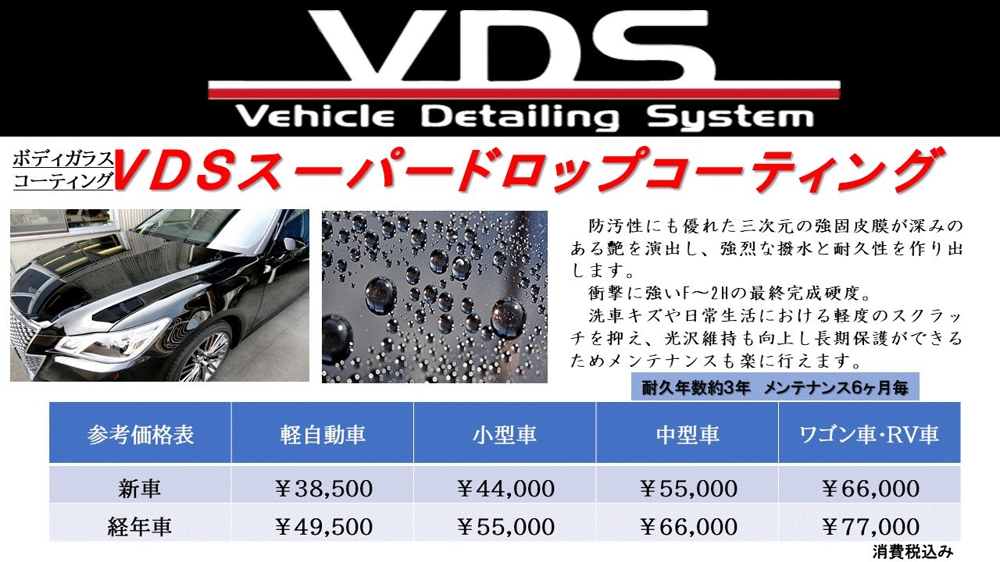
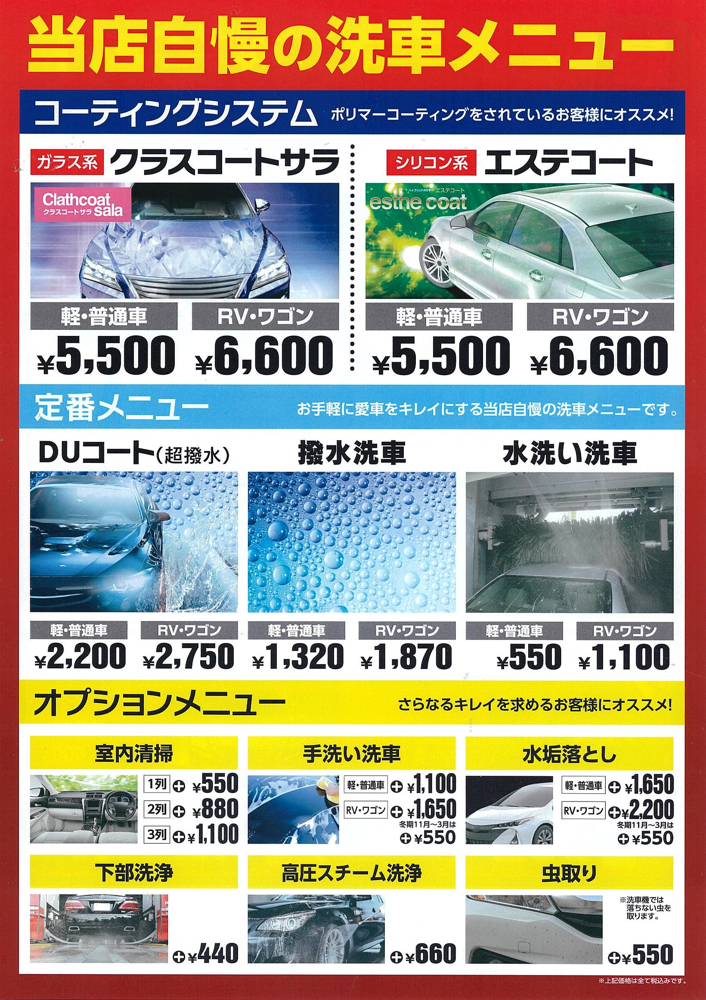

## 新型 洗車機 2020年導入

## VDSスーパードロップコーティング
### (ガラスコーティング)
新車より美しいツヤが長期間持続。ガラス系の強固被膜で汚れから守り、愛車の価値が上がるコーティング

  

## クラスコートサラ
### (洗車機コーティング)
ガラスコーティングをされている車、濃色車におすすめ。光沢をアップさせコーティングの耐久性を大幅に引き上げます

## エステコート
### (洗車機コーティング)
ポリマーコーティングをされている車、淡色車におすすめ。手掛けポリマーのような艶を短時間で実現します

## 手洗い洗車
プロの技術で隅々まで美しく洗い上げます。コーティング車にも安心してご利用いただけます
## 洗車機洗車
２０２０年度導入の最新型洗車機でお客様の愛車を洗い上げます

## オプションメニュー(例)
### 下部洗浄
塩カルや泥汚れなど、車の下側をスチーム洗浄します
### ヘッドライトクリーニング
色あせや黄ばみを専用クリーナーでスッキリ除去します

  

## ご予約・お問い合わせはこちら
<a href="tel:0260272232">☎ 0260-27-2232</a>

####  営業時間：月-土, 7:00-20:00（祝日は休業日）
####  長野県下伊那郡下條村睦沢９２９７−４
